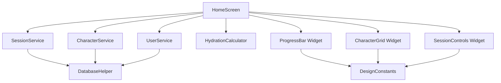

# Design Document

## Overview

The Sipster MVP implements a session-based hydration tracking system with gamified boba character progression, designed for cross-platform deployment (mobile and desktop). The system follows a modular Flutter architecture with clear separation between data persistence, business logic, and presentation layers. 

The design leverages existing implemented components including SQLite database schema, service layers, and UI widgets, while addressing multi-platform UI adaptation requirements and enhanced safety monitoring features.

## Steering Document Alignment

### Technical Standards (tech.md)
No steering documents exist, so the design follows Flutter best practices and Material Design 3 principles. The existing codebase demonstrates good separation of concerns with dedicated service layers, model classes, and reusable widgets.

### Project Structure (structure.md)
Following the established project structure:
- `lib/models/` - Data models with JSON serialization
- `lib/services/` - Business logic and data operations
- `lib/widgets/` - Reusable UI components
- `lib/screens/` - Screen-level UI orchestration
- `lib/theme/` - Design system and constants

## Code Reuse Analysis

### Existing Components to Leverage
- **DatabaseHelper**: Already implements SQLite schema for users, sessions, and characters with seeded boba characters
- **SessionService**: Provides session CRUD operations, active session management, and container parsing
- **CharacterService**: Handles character unlocking based on hydration patterns (partially implemented)
- **UserService**: Manages user profile and goal calculations
- **HydrationCalculator**: Implements safety calculations and progress tracking
- **DesignConstants**: Comprehensive design system with boba-themed color palette and typography
- **HomeScreen**: Core UI orchestration with service integration (existing implementation)

### Integration Points
- **SQLite Database**: All data operations go through DatabaseHelper singleton with established schema
- **Service Layer Pattern**: Services are dependency-injected into UI components for testability
- **Model Classes**: JSON serializable models with established fromJson/toJson patterns
- **Material Theme**: Custom purple-themed Material 3 design integrated with DesignConstants

## Architecture

The system follows a layered architecture pattern with clear separation of concerns:

1. **Presentation Layer**: Screens and widgets handle UI state and user interactions
2. **Service Layer**: Business logic and data orchestration 
3. **Data Layer**: Database operations and model persistence
4. **Theme Layer**: Design system providing consistent visual language

### Modular Design Principles
- **Single File Responsibility**: Each service handles one domain (sessions, characters, users)
- **Component Isolation**: UI widgets are self-contained with clear props interface
- **Service Layer Separation**: Business logic isolated from presentation concerns
- **Platform Abstraction**: UI adapts to platform constraints while sharing core logic



## Components and Interfaces

### Enhanced Session Management
- **Purpose:** Extend existing SessionService with multi-platform session timeout handling and container memory
- **Interfaces:** 
  - `Future<void> handleSessionTimeout(String sessionId)` - Platform-appropriate reminder
  - `Future<List<String>> getLearnedContainers()` - User's typical containers
- **Dependencies:** DatabaseHelper, Platform detection utilities
- **Reuses:** Existing SessionService CRUD operations and container parsing

### Platform-Adaptive UI Manager
- **Purpose:** Handle platform-specific UI adaptations and layout constraints
- **Interfaces:**
  - `bool isMobile()` - Platform detection
  - `bool isDesktop()` - Desktop platform check
  - `EdgeInsets getPlatformPadding()` - Platform-appropriate spacing
  - `int getCharacterDisplayCount()` - Optimal character count per platform
- **Dependencies:** Flutter Platform class, MediaQuery
- **Reuses:** DesignConstants for base spacing and sizing values

### Enhanced Safety Monitor
- **Purpose:** Extend HydrationCalculator with visual warning system and kidney load tracking
- **Interfaces:**
  - `SafetyWarning? evaluateSessionSafety(double ml, Duration duration)`
  - `double calculateKidneyLoad(List<HydrationSession> hourlyHistory)`
  - `Color getWarningColor(SafetyLevel level)`
- **Dependencies:** Existing HydrationCalculator, DesignConstants
- **Reuses:** Current safety calculation logic and warning thresholds

### Multi-Platform Notification Service  
- **Purpose:** Handle platform-specific reminder notifications
- **Interfaces:**
  - `Future<void> scheduleSessionReminder(String sessionId, Duration delay)`
  - `Future<void> cancelSessionReminders(String sessionId)`
  - `Future<bool> requestNotificationPermissions()`
- **Dependencies:** flutter_local_notifications, platform_specific implementations
- **Reuses:** Session timing logic from SessionService

## Data Models

### Enhanced HydrationSession (Extend Existing)
```dart
class HydrationSession {
  String id;
  DateTime startTime;
  DateTime? endTime;
  double targetMl;
  double? actualMl;
  String containerType;
  bool isActive;
  // New fields for enhanced functionality
  Duration? reminderDelay; // Calculated based on user patterns
  String? platformContext; // "mobile", "desktop", "tablet"
}
```

### SafetyWarning (New Model)
```dart
class SafetyWarning {
  SafetyLevel level; // info, warning, danger
  String message;
  String title;
  Duration? suggestedDelay;
  Color warningColor;
}

enum SafetyLevel { info, warning, danger }
```

### PlatformPreferences (New Model)
```dart
class PlatformPreferences {
  String platform;
  int preferredCharacterCount;
  bool enableNotifications;
  Duration defaultReminderDelay;
  String layoutMode; // compact, expanded
}
```

## Error Handling

### Error Scenarios
1. **Database Connection Failure**
   - **Handling:** Graceful degradation with in-memory fallback for current session
   - **User Impact:** Warning message with retry option, session data preserved

2. **Session Timeout Edge Cases**
   - **Handling:** Auto-complete with target amount, log as incomplete session
   - **User Impact:** Gentle notification explaining auto-completion

3. **Platform Permission Denied (Notifications)**
   - **Handling:** Fall back to in-app reminders only
   - **User Impact:** Settings option to re-request permissions

4. **Character Unlock Calculation Errors**
   - **Handling:** Default to conservative unlock approach, log for debugging
   - **User Impact:** Character may unlock later than expected, no data loss

## Testing Strategy

### Unit Testing
- Service layer methods for session management, safety calculations, character unlocking
- Model serialization/deserialization (fromJson/toJson)
- Platform adaptation utility functions
- Safety warning calculation logic

### Integration Testing  
- Database operations with SQLite in-memory database
- Service interactions (session completion triggering character checks)
- Platform-specific notification scheduling
- Multi-platform layout adaptations

### End-to-End Testing
- Complete hydration session flow: start → drink → complete → character reaction
- Safety warning triggers and user responses
- Multi-platform UI adaptation (widget tests with different screen sizes)
- Database persistence across app restarts

## Platform-Specific Implementation Details

### Mobile Implementation
- **Layout:** Single-column vertical layout optimized for portrait
- **Navigation:** Bottom navigation or tab bar for primary actions
- **Characters:** 3-5 characters displayed prominently with large touch targets
- **Notifications:** Native push notifications with custom boba character messages

### Desktop Implementation  
- **Layout:** Multi-column layout utilizing horizontal screen space
- **Navigation:** Side navigation panel or menu bar integration
- **Characters:** Expanded character grid showing 8-12 characters simultaneously
- **Notifications:** System tray notifications with hover actions

### Tablet Implementation
- **Layout:** Adaptive layout switching between mobile and desktop modes based on orientation
- **Navigation:** Contextual navigation adapting to available screen space
- **Characters:** Responsive character grid scaling from 6-10 characters based on screen size
- **Notifications:** Combination approach using both in-app and system notifications

## Multi-Platform UI Adaptation Strategy

### Responsive Breakpoints
```dart
class PlatformBreakpoints {
  static const double mobileMaxWidth = 600;
  static const double tabletMaxWidth = 1024;
  static const double desktopMinWidth = 1024;
}
```

### Adaptive Component Rendering
- **Character Display:** Dynamic grid sizing based on screen real estate
- **Session Controls:** Platform-appropriate button sizing and interaction patterns  
- **Progress Indicators:** Scalable visualizations for different screen densities
- **Safety Warnings:** Platform-native alert styling and positioning

This design maintains the established architectural patterns while extending functionality to meet the multi-platform requirements and enhanced safety features outlined in the requirements document.